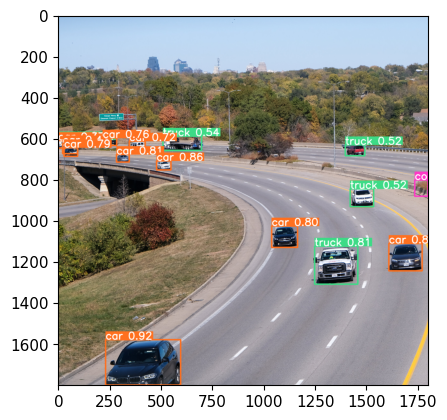
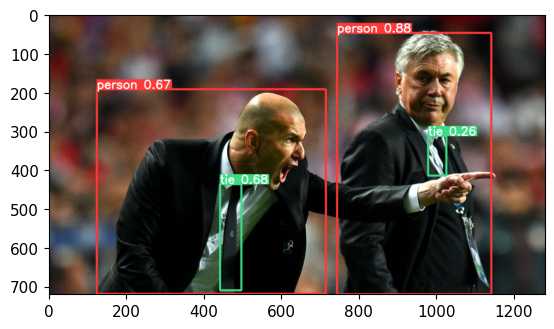

# YOLO Object Detection

Deploying the pre-trained YOLOv5s model, along with fine-tuning the model to detect a distracted(on phone) vs focused user.

## Introduction
This repo is an implementation of the YOLO (You Only Look Once) object detection system. The pre trained model I used was through Ultralytics and can be found on their GitHub.

In this notebook, I demonstrate the application of YOLO for detecting objects in images using the pre trained COCO classes. Then, I take things a step further and create a custom dataset and fine tune the model using those images. This new dataset, focused and distracted, features 20 images of me being focused vs distracte(on my phone). 

This notebook is capable of processing static images, video files, and even real time footage from your webcam. You can run both the pre-trained model and the fine-tuned model.

## Results
These results showcase the way the model renders results. The labels are from the COCO classes.

Along with that, the fine-tuned model is able to reasonably detect distraction(on my phone) vs focusing in real time via a web cam.